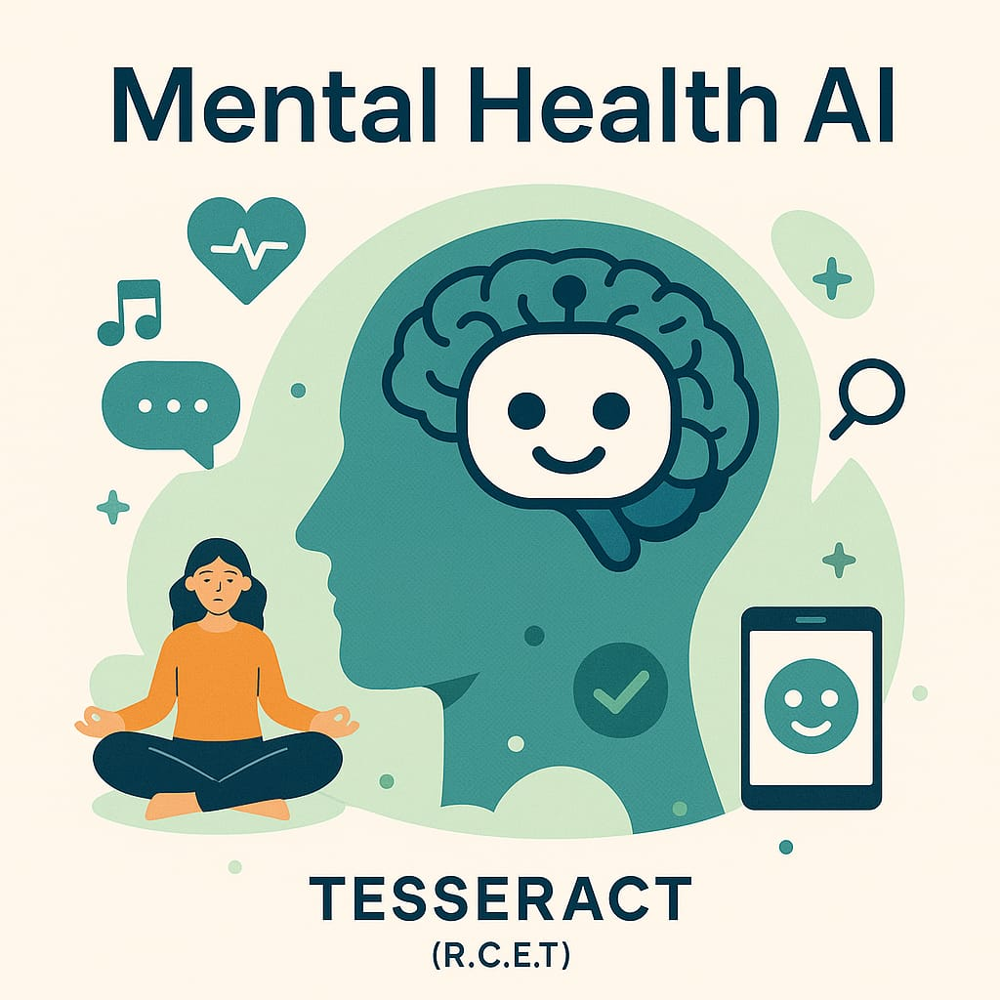

# techfest36-Tesseract-RCET-Roushan-kumar



## About the team
> College: Rungta College Of Engineering And Technology, Bhilai,CG (R1)
>"Team members:
1. Roushan kumar(Lead) : Backend  and Chatbot Development 
2. Kundan Kumar : Frontend
3. Piyush Kumar : Frontend and Backend Integration
4. Prachi Arya : UI Design
5. Aayushi Kumari: PPT"

## PPT

### Project Presentation

[Download Presentation (PPTX)](presentation/tesseract(R.C.E.T).pptx)


## Healthcare AI Related To Mental Health
 AI-driven mental health assistant designed to help users reflect on their emotions through a short 8-question wellness check. It provides personalized suggestions, offers a Smart AI Chatbot for supportive conversation, and rewards users with a temporary motivational token. The project focuses on mental well-being, privacy, and emotional support, all without requiring any login.

## Description
Mental-Health-AI is an AI chatbot that helps users assess their mental well-being through interactive questions and provides personalized self-care recommendations. It also engages users in calming activities like music therapy and story telling to enhance mental relaxation.


## Tag-line
>"*A Friend That Listens, Suggests, and Cares — That's Mental-Health-AI.*"

## Features

- Anonymous Interaction (no login, just nickname)
- 8-question mental health assessment
- Personalized wellness suggestions
- Smart Supportive Chatbot (rule-based)
- **Relaxing music** for calming the user after assessment
- **Self-care activities**
   > Breathing
   > Meditation
   > Music Listening 
   > Stories(can be listened)
   > Book summaries (could be listened)
- Temporary Motivational Token as a reward
- Calm and Relaxing UI for a positive user experience
- Focused on mental health awareness and emotional support
- In serious conditions, therapist session is suggested

## Workflow 

1. User enters a **nickname** to make the conversation personal
 
2. User answers **8 mental health-related questions**

3. The AI calculates a **wellness score** based on the responses
   
4. Based on the score, the AI provides **personalized suggestions** acording to respective mental health level(low, moderate, high)
 
5. User is given an option to either:
   - End the session and receive a **Motivational Temporary Token**  
   - Or continue chatting with the **Smart Supportive Chatbot**
     
6. The Chatbot offers emotional support using predefined responses  
7. After interaction, the token fades — symbolizing that **difficulties are temporary too**

## Why Us?
>"*Just like the token disappears, struggles too will fade. Our project focuses on reminding the user that everything is temporary — including their current emotional state.*"

It is simple, fast, and focused on making users feel better without worrying about accounts, data, and complexity.

##  Alignment With UNSDG
Our project contributes to:
Goal 3 - Good Health and Well-being  
>"*Promotes mental well-being through reflection, personalized suggestions, and emotional support.*"

## Tech Stack

1. HTML — Frontend Structure
2. CSS — Styling and Calm UI
3. JavaScript — Handling token display, Music player, and UI interactivity
4. Python — Core logic for:
    - Asking 8 mental health questions
    - Calculating the wellness score
    - Generating personalized suggestions
    - Building the chatbot
5. Figma — UI/UX
6. Flask 

## UI/UX Tips

 1. Simple & Friendly Design – Using calming colors (blue, green) to promote relaxation. 
 2. Conversational UI – The chatbot that feels natural and easy to use. 
 3. Minimal User Input – Keeping the process short (8 questions max). 
 4. Gamification – Show progress bars, reward animations for NFT achievements. 
 5. Accessibility – Ensure clear fonts, easy navigation, and mobile-friendly design.


## To clone this repo
 copy the following command 

 ```sh
 git clone https://github.com/Roushan-77/techfest36-Tesseract-RCET-Roushan-kumar.git
 ```

## command to add , commit and push your work 

```sh
git add <file name>
```
```sh
git commit -m "your work detail"
```
```sh
git push origin <branch name>
```
